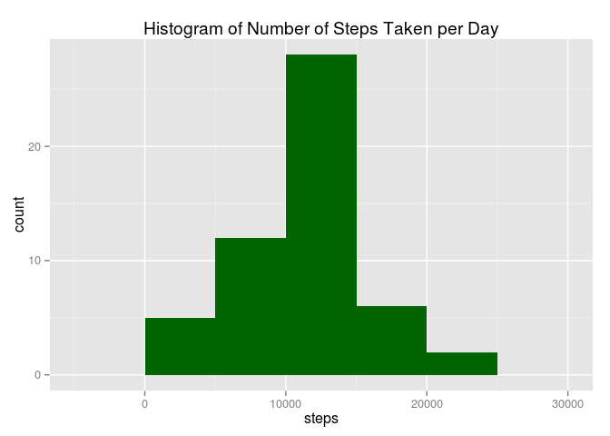
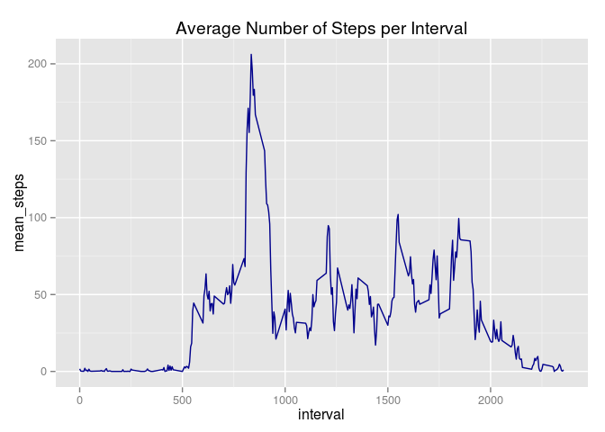
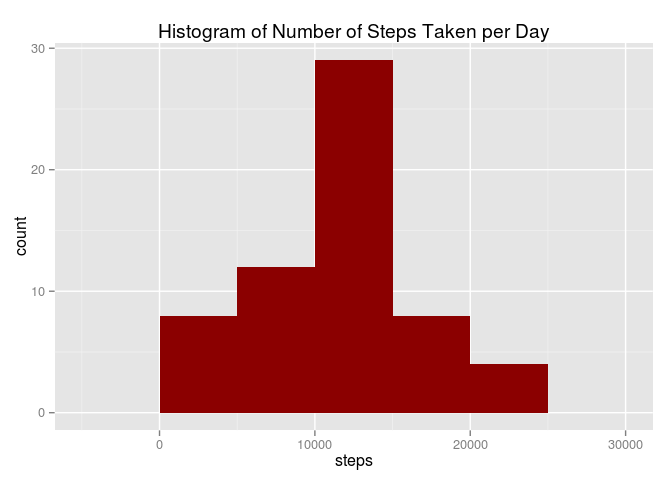
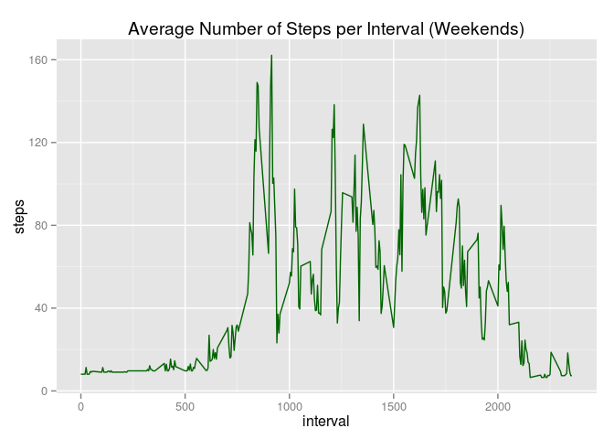
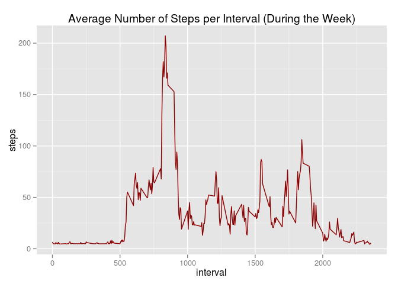

# Reproducible Research: Peer Assessment 1


## Loading and preprocessing the data


```r
#original data
raw_data <- read.csv('activity.csv')
#steps per day
spd <- aggregate(. ~ date, data=raw_data[,c(1,2)], FUN=sum)
names(spd)[2] <- c('sum_steps')
#steps per interval
spi <- aggregate(. ~ interval, data=raw_data[,c(1,3)], FUN=mean)
names(spi)[2] <- c('mean_steps')
```

## What is mean total number of steps taken per day?
Plotting a histogram

```r
library(ggplot2)
qplot(sum_steps, data=spd, 
      main='Histogram of Number of Steps Taken per Day', xlab='steps', 
      binwidth=5000,fill=I('darkgreen'))
```

 

Calculating mean and median of the number of steps 

```r
mean(spd$sum_steps, na.rm=TRUE)
```

```
## [1] 10766.19
```

```r
median(spd$sum_steps, na.rm=TRUE)
```

```
## [1] 10765
```


## What is the average daily activity pattern?
Plotting average number of steps per interval

```r
qplot(interval, mean_steps, data=spi, 
      main='Average Number of Steps per Interval', 
      geom='line', color=I('darkblue'))
```

 

Interval with maximum average number of steps over all days

```r
spi[ spi$mean_steps == max(spi$mean_steps), ]$interval
```

```
## [1] 835
```

## Imputing missing values
Total number of missing values in the dataset (i.e. the total number of rows with NAs)

```r
sum(!complete.cases(raw_data))
```

```
## [1] 2304
```
Create a new dataset that is equal to the original dataset but with the missing data filled with average number of steps for this interval over all days

```r
#copy raw data to new object
raw_data_nona <- raw_data
#replace missing number of steps values in each row with average for that interval  
raw_data_nona[is.na(raw_data_nona$steps),]$steps <- 
  merge(raw_data, spi, by = "interval", 
        sort = FALSE)[is.na(raw_data$steps),]$mean_steps
#recalculate stepas per day and per interval
#steps per day
spd <- aggregate(. ~ date, data=raw_data_nona[,c(1,2)], FUN=sum)
names(spd)[2] <- c('sum_steps')
#steps per interval
spi <- aggregate(. ~ interval, data=raw_data_nona[,c(1,3)], FUN=mean)
names(spi)[2] <- c('mean_steps')
```

Make a histogram of the total number of steps taken each day

```r
library(ggplot2)
qplot(sum_steps, data=spd, 
      main='Histogram of Number of Steps Taken per Day', xlab='steps', 
      binwidth=5000,fill=I('darkred'))
```

 

Calculate and report the mean and median total number of steps taken per day

```r
mean(spd$sum_steps, na.rm=TRUE)
```

```
## [1] 10889.8
```

```r
median(spd$sum_steps, na.rm=TRUE)
```

```
## [1] 11015
```
As you can see this values are slightly above the results from data where NAs were not replaced by averages. This is the impact of imputing missing data on the estimates of the total daily number of steps.


## Are there differences in activity patterns between weekdays and weekends?
Create two new datasets for average number of steps for each interval on WE and during the week, using data with imputted missing values


```r
library(lubridate)
spi_we <- aggregate(. ~ interval, 
                    data=raw_data_nona[wday(raw_data$date) %in% c(1,7),c(1,3)], 
                    FUN=mean)

spi_nowe <- aggregate(. ~ interval, 
                      data=raw_data_nona[!wday(raw_data$date) %in% c(1,7),c(1,3)],
                      FUN=mean)
```

Plot the data to see the difference

```r
qplot(interval, steps, data=spi_we, 
      main='Average Number of Steps per Interval (Weekends)', 
      geom='line', color=I('darkgreen'))
```

 

```r
qplot(interval, steps, data=spi_nowe, 
      main='Average Number of Steps per Interval (During the Week)', 
      geom='line', color=I('darkred'))
```

 
